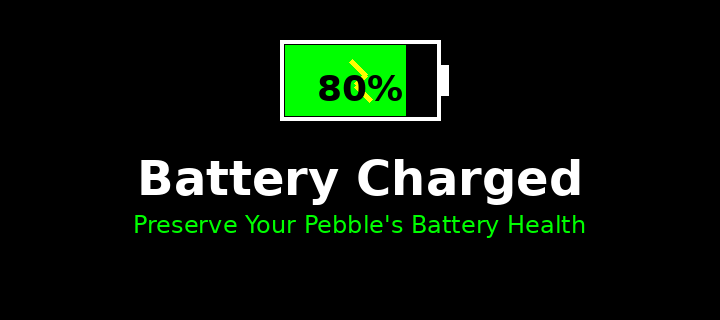
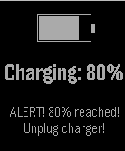

# Pebble Battery Charged

Preserve your Pebble smartwatch's battery health by preventing overcharging. Get notified when your battery reaches 80% charge so you can unplug it and extend your battery's lifespan.

## Why 80%?

Lithium-ion batteries last longer when kept between 20-80% charge. Repeatedly charging to 100% accelerates capacity degradation over time. This app helps you maintain optimal charge levels to preserve your Pebble's battery health.

## Features

- **Smart notifications** - Alerts you when battery reaches 80%
- **On-device alerts** - Visual message and vibration on your Pebble
- **Remote notifications** - Optional Pushbullet or custom webhook support
- **Simple setup** - Configure once and protect your battery automatically

## Installation

Install directly from the Pebble app store:

**[Download from Rebble Store](https://apps.repebble.com/e7540c9775d545af81ba7f3f)**

## How It Works

1. Wear your Pebble and start charging as normal
2. When battery level reaches 80%, the app triggers notifications:
   - Displays a message on your watch face
   - Vibrates repeatedly to get your attention
   - Sends a remote notification (if configured)
3. Unplug your Pebble to preserve battery health

## Configuration

### Remote Notifications (Optional)

Configure remote notifications in the app settings:

- **Pushbullet** - Enter your Pushbullet access token to receive push notifications on your phone/computer
- **Custom Webhook** - Provide a webhook URL for integration with other services

## Contributing

Found a bug or have a feature request? [Open an issue](https://github.com/rephus/pebble-battery-charged/issues) or submit a pull request!

## License

See [LICENSE](LICENSE) file for details.
